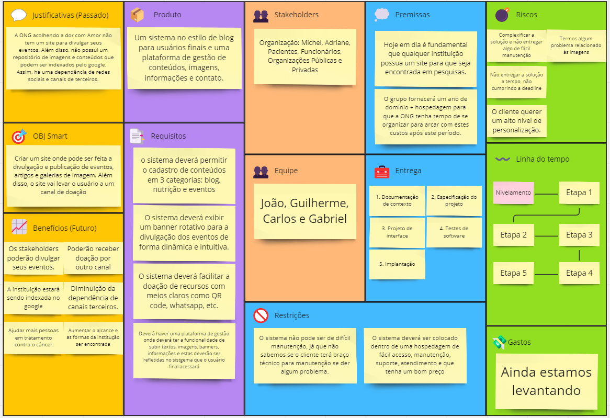
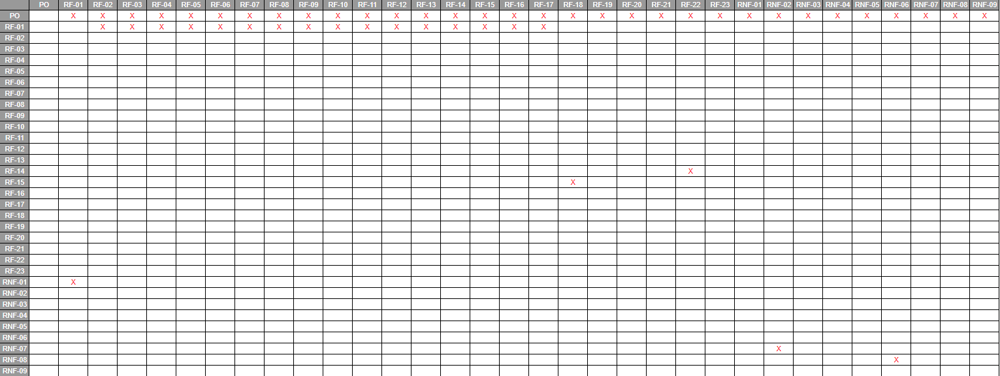

# Especificações do Projeto

Pré-requisitos: <a href="1-Documentação de Contexto.md"> Documentação de Contexto</a>

Definição do problema e ideia de solução a partir da perspectiva do usuário. É composta pela definição do  diagrama de personas, histórias de usuários, requisitos funcionais e não funcionais além das restrições do projeto.

Apresente uma visão geral do que será abordado nesta parte do documento, enumerando as técnicas e/ou ferramentas utilizadas para realizar a especificações do projeto

## Arquitetura e Tecnologias

o	Descreva brevemente a arquitetura definida para o projeto e as tecnologias a serem utilizadas. Sugere-se a criação de um diagrama de componentes da solução.

## Project Model Canvas

## Requisitos

As tabelas abaixo apresentam os requisitos funcionais e não funcionais da aplicação, definindo o escopo do projeto. Também, há as restrições e a maneira que utilizamos para determinar a prioridade das tarefas que serão realizadas.

### Requisitos Funcionais

| RF    | Descrição                                                                                                   | Prioridade |
|-------|-------------------------------------------------------------------------------------------------------------|------------|
| RF-01 | Autenticação de dois fatores para o login do admin                                                          | Alta       |
| RF-02 | O sistema deverá permitir ao administrador criar artigos                                                    | Alta       |
| RF-03 | O sistema deverá permitir ao administrador editar artigos                                                   | Alta       |
| RF-04 | O sistema deverá permitir ao administrador excluir artigos                                                  | Alta       |
| RF-05 | O sistema deverá permitir ao administrador realizar upload de imagens                                       | Alta       |
| RF-06 | O sistema deverá permitir ao administrador realizar exclusão de imagens                                      | Alta       |
| RF-07 | O sistema deverá permitir ao administrador realizar edições de imagens (colocar legenda, por exemplo)                                      | Alta       |
| RF-08 | O sistema deverá permitir ao administrador criar eventos                                                    | Alta       |
| RF-09 | O sistema deverá permitir ao administrador editar eventos                                                   | Alta       |
| RF-10 | O sistema deverá permitir ao administrador excluir eventos                                                  | Alta       |
| RF-11 | O sistema deverá permitir ao administrador criar informações de nutrição                                    | Alta       |
| RF-12 | O sistema deverá permitir ao administrador editar informações de nutrição                                   | Alta       |
| RF-13 | O sistema deverá permitir ao administrador excluir informações de nutrição                                  | Alta       |
| RF-14 | O sistema deverá permitir ao administrador editar informações da empresa, como email, telefone, Instagram, Facebook e YouTube | Alta       |
| RF-15 | O sistema deverá permitir ao administrador criar banners                                                    | Alta       |
| RF-16 | O sistema deverá permitir ao administrador editar banners                                                   | Alta       |
| RF-17 | O sistema deverá permitir ao administrador excluir banners                                                  | Alta       |
| RF-18 | O sistema deverá incluir um cabeçalho na interface com links para as telas de artigos, nutrição, eventos, contato e doações | Média      |
| RF-19 | O sistema deverá implementar um carrossel na interface principal exibindo eventos                           | Média      |
| RF-20 | O sistema deverá implementar um carrossel na interface principal exibindo informações de nutrição          | Média      |
| RF-21 | O sistema deverá implementar um carrossel na interface principal exibindo artigos                           | Média      |
| RF-22 | O sistema deverá incluir um formulário de contato para os usuários entrarem em contato com a empresa       | Média      |
| RF-23 | O sistema deverá incluir um rodapé na interface do sistema com informações adicionais                       | Baixa      |

### Requisitos não Funcionais

| RFN   | Descrição                                                                                                   | Prioridade |
|-------|-------------------------------------------------------------------------------------------------------------|------------|
| RFN-01| O sistema deve garantir segurança no login através de criptografia | Alta       |
| RFN-02| O sistema deve ser responsivo, adaptando-se a diferentes dispositivos e tamanhos de tela                  | Alta       |
| RFN-03| O sistema deve ser de fácil utilização, com uma interface intuitiva e amigável                              | Alta       |
| RFN-04| O sistema deve ter um tempo de resposta rápido para as interações do usuário                                | Alta       |
| RFN-05| O sistema deve ser escalável, capaz de lidar com um aumento significativo no número de usuários             | Alta       |
| RFN-06| O sistema deve garantir disponibilidade, com um tempo de inatividade planejado mínimo                        | Média      |
| RFN-07| O sistema deve ser compatível com os principais navegadores web e sistemas operacionais                     | Baixa      |
| RFN-08| O sistema deve ser desenvolvido de acordo com as melhores práticas de desenvolvimento de software          | Média      |
| RFN-09| O sistema deve estar em conformidade com as regulamentações de proteção de dados e privacidade              | Média      |

## Restrições

O projeto está restrito pelos itens apresentados na tabela a seguir.

|ID| Restrição                                             |
|--|-------------------------------------------------------|
|01| O projeto deverá ser entregue até o final do semestre |
|02| A aplicação deverá ser construída por alunos do curso de Tecnologia em Análise e Desenvolvimento de Sistemas Virtual da PUCMinas, do eixo 5       |
|03| A plicação deverá estar no github, bem como sua documentação|
|04| A aplicação deverá estar hospedada em algum provedor de domínio como hostinger, hostigator, uol, etc|
|05| A aplicação usará Prisma como ORM, Express como framework de Node e Postgress como banco de dados. Utilizaremos Angular no frontend|
|06| A aplicação não terá mobile|
|07| A hospedagem deverá ser doada pelo grupo|

## Matriz de Rastreabilidade de Requisitos

## Diagrama de Casos de Uso

O diagrama de casos de uso é o próximo passo após a elicitação de requisitos, que utiliza um modelo gráfico e uma tabela com as descrições sucintas dos casos de uso e dos atores. Ele contempla a fronteira do sistema e o detalhamento dos requisitos funcionais com a indicação dos atores, casos de uso e seus relacionamentos. 

As referências abaixo irão auxiliá-lo na geração do artefato “Diagrama de Casos de Uso”.

> **Links Úteis**:
> - [Criando Casos de Uso](https://www.ibm.com/docs/pt-br/elm/6.0?topic=requirements-creating-use-cases)
> - [Como Criar Diagrama de Caso de Uso: Tutorial Passo a Passo](https://gitmind.com/pt/fazer-diagrama-de-caso-uso.html/)
> - [Lucidchart](https://www.lucidchart.com/)
> - [Astah](https://astah.net/)
> - [Diagrams](https://app.diagrams.net/)

## Modelo ER (Projeto Conceitual)

O Modelo ER representa através de um diagrama como as entidades (coisas, objetos) se relacionam entre si na aplicação interativa.

Sugestão de ferramentas para geração deste artefato: LucidChart e Draw.io.

A referência abaixo irá auxiliá-lo na geração do artefato “Modelo ER”.

> - [Como fazer um diagrama entidade relacionamento | Lucidchart](https://www.lucidchart.com/pages/pt/como-fazer-um-diagrama-entidade-relacionamento)

## Projeto da Base de Dados

O projeto da base de dados corresponde à representação das entidades e relacionamentos identificadas no Modelo ER, no formato de tabelas, com colunas e chaves primárias/estrangeiras necessárias para representar corretamente as restrições de integridade.
