# Planos de Testes de Software

# Evidências de Testes de Software

## Evidências do back-end

Os testes no backend são feitos utilizando Jest. Para rodar o teste localmente precisamos criar uma imagem do banco de dados via docker. Iniciamos a API e o Docker para montar o ambiente da aplicação e depois precisamos rodar teste por teste, onde possui suites e casos de testes.

Para acessar os testes dentro do código, basta ir em aplicações> backend > src > test > unit

Esses testes são validados previamente com testes de rotas em ferramentas como postman. Depois disso fazemos a criação dos testes unitários.

### Login

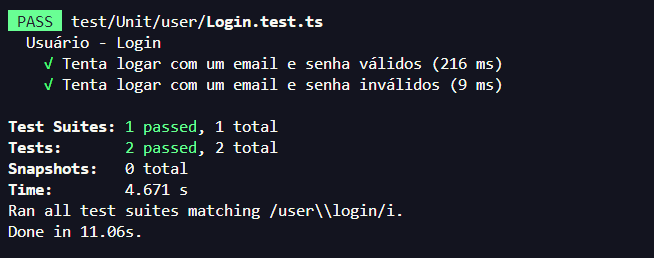

### GetUser

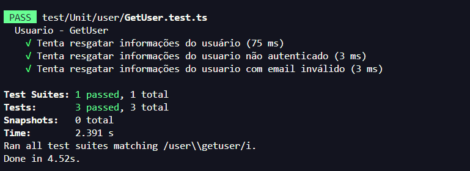

### Get - Company

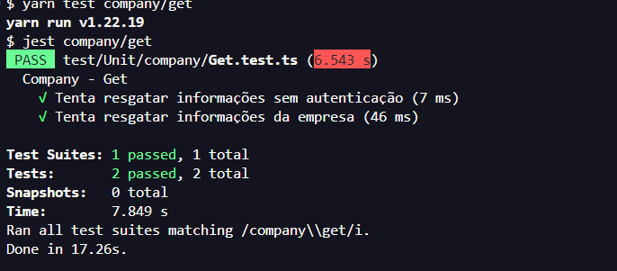

### Update - Company

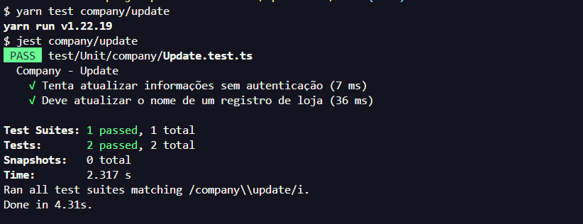

### Create - Artigo

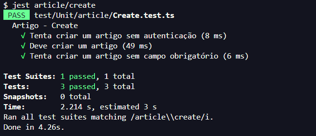

### DeleteByID - Artigo

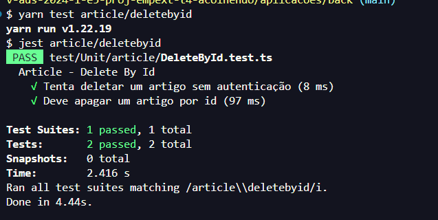

### GetAll - Artigo

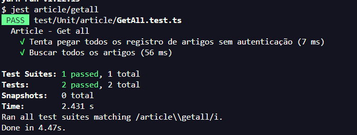

### GetByID - Artigo

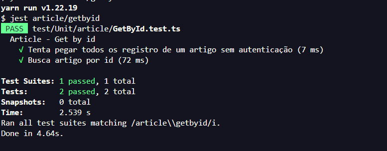

### UpdateByID - Artigo

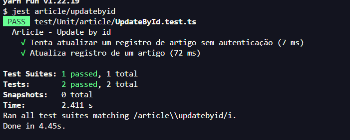

### Create - Banner

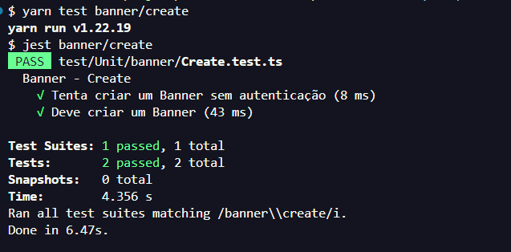

### DeleteById - Banner

### GetAll - Banner

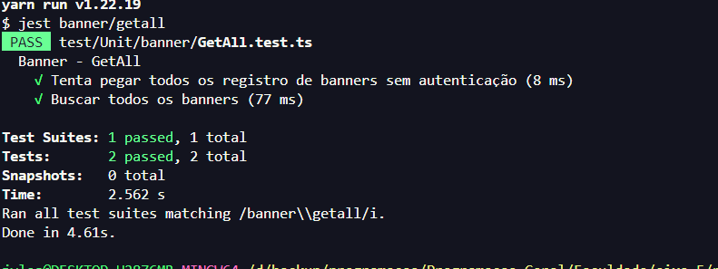

### GetById - Banner

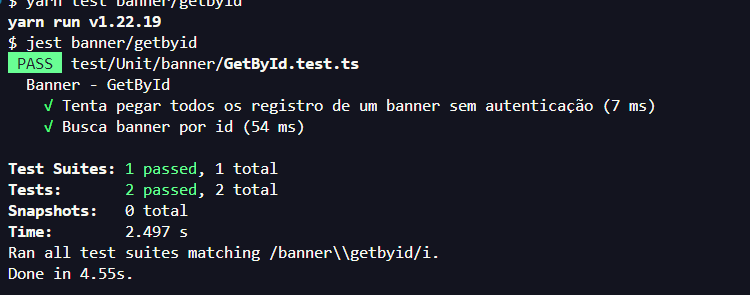

### UpdateById - Banner

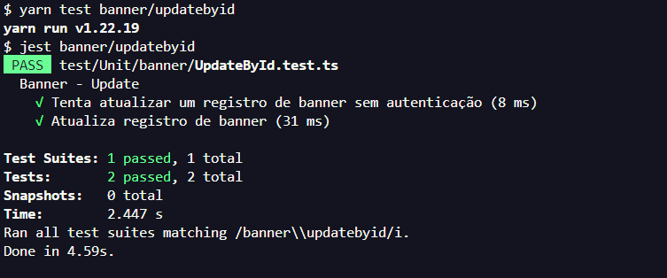

### Create - Galeria

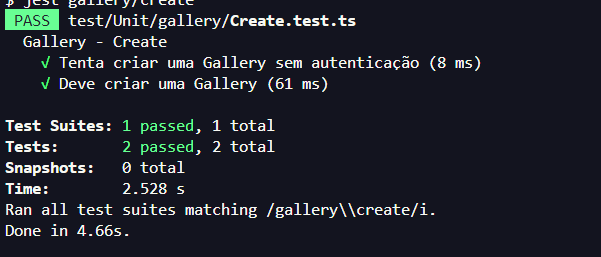

### DeleteById - Galeria

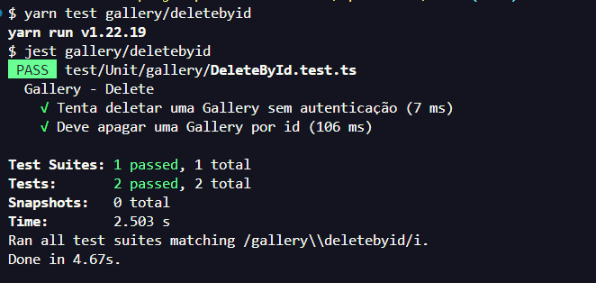

### GetAll - Galeria

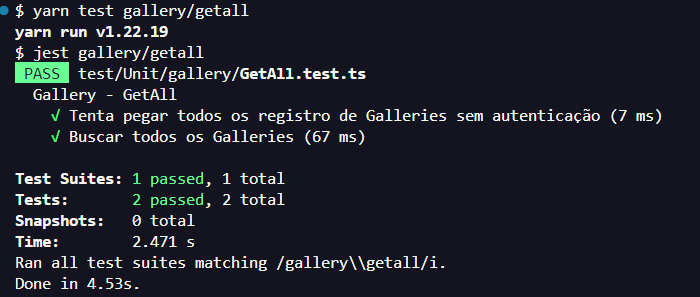

### GetById - Galeria

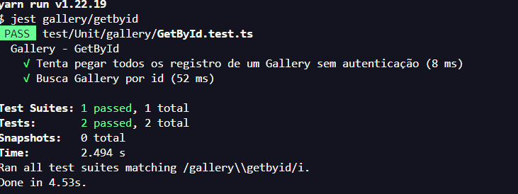

### UpdateById - Galeria

## Evidências do FrontEnd (UI)

Esses testes servem apenas para verificarmos se a interface está de acordo com o funcionamento esperado. A integração com o backend ainda está sendo feita até o momento deste envio, então os registros são das telas.

### Login

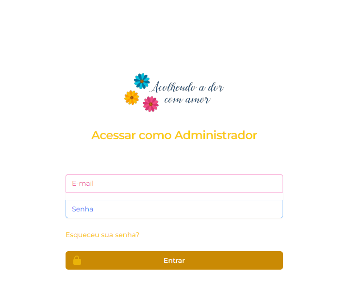

### Eventos/ Nutrição / Artigos (são o mesmo princípio)

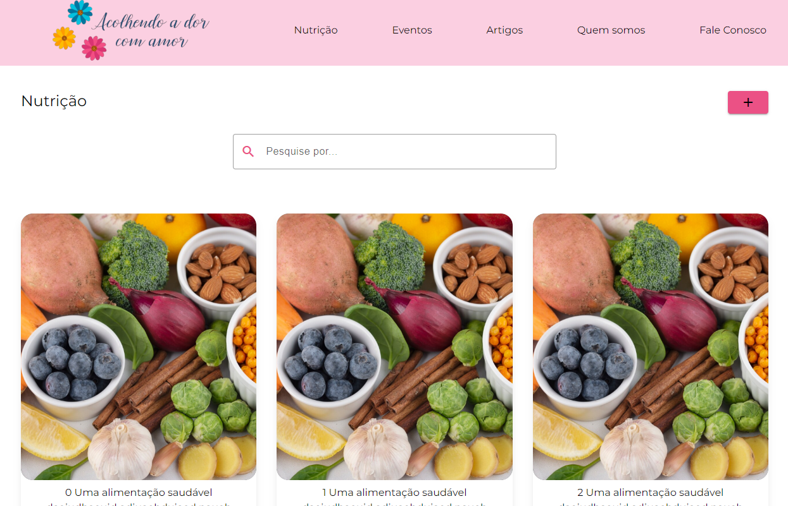

#### Criação artigo
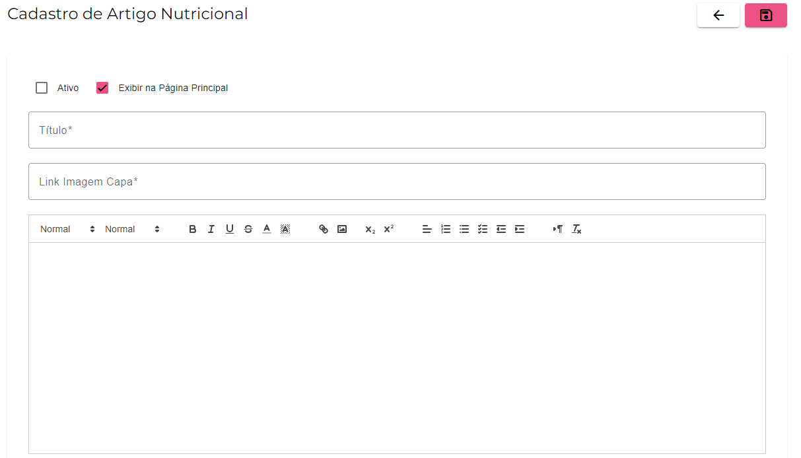

### Quem somos

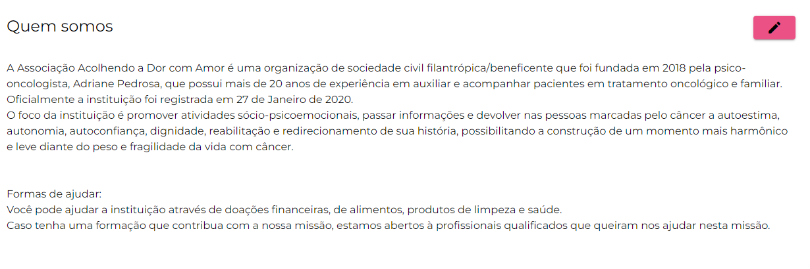

### Fale Conosco

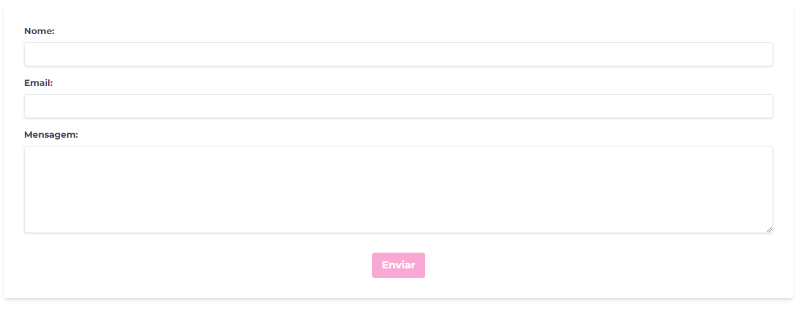
