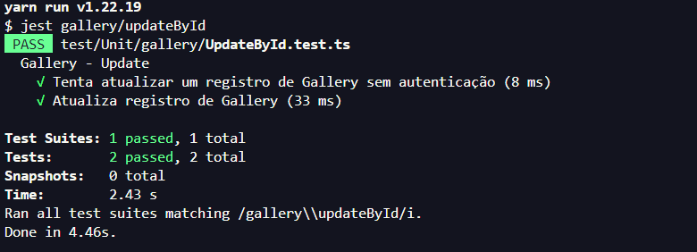
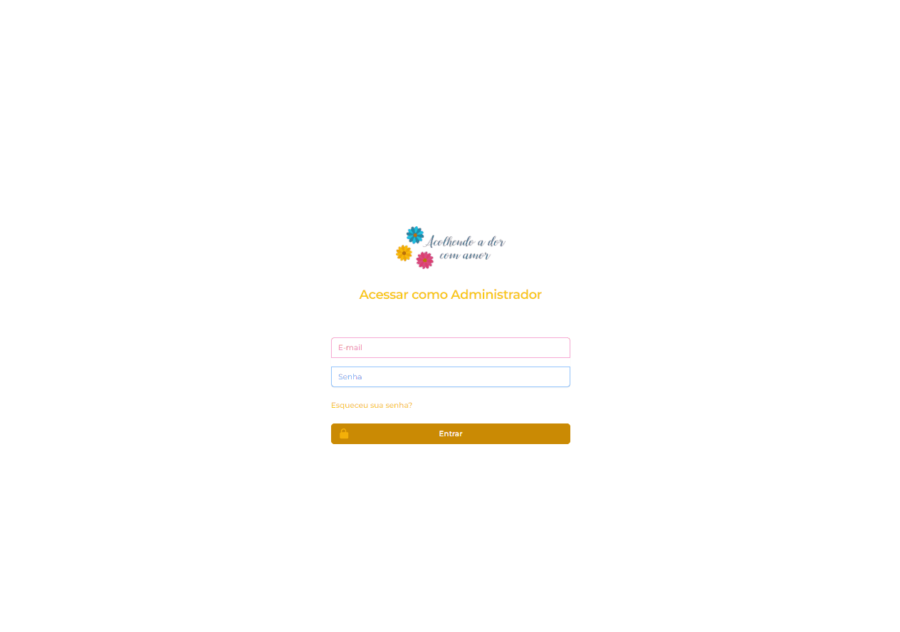
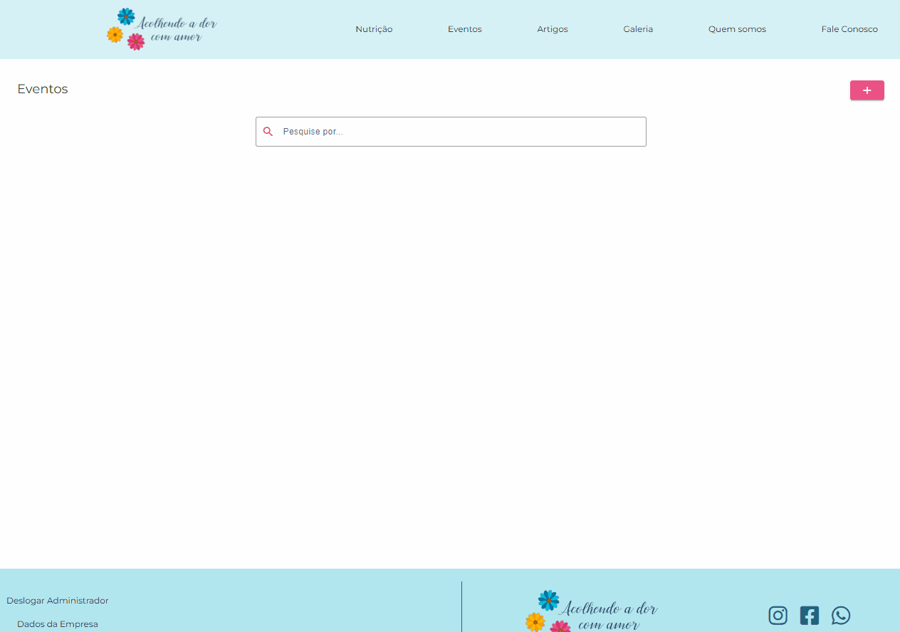
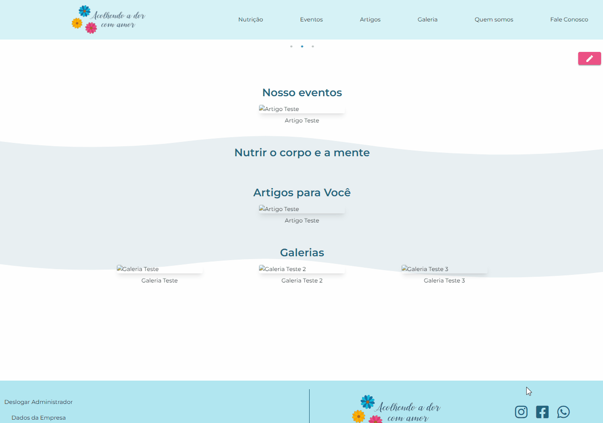
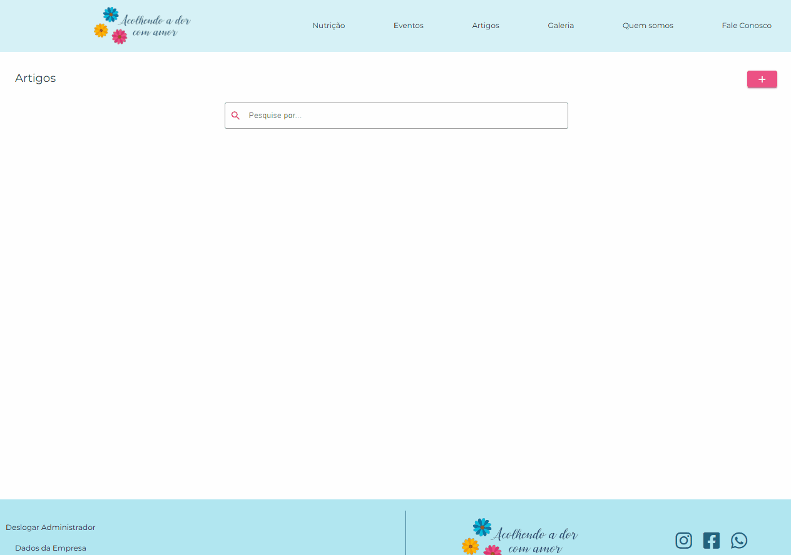
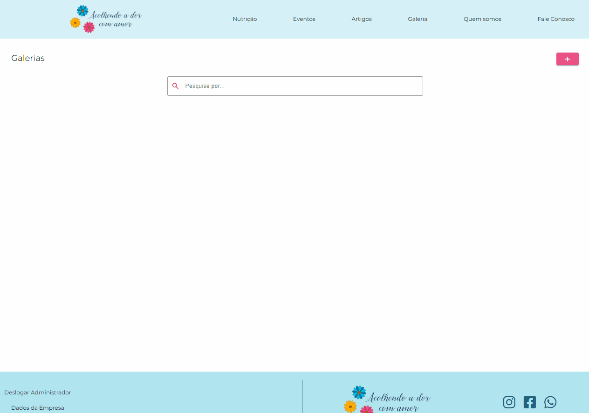

# Planos de Testes de Software

# Evidências de Testes de Software

## Evidências do back-end

Os testes no backend são feitos utilizando Jest. Para rodar o teste localmente precisamos criar uma imagem do banco de dados via docker. Iniciamos a API e o Docker para montar o ambiente da aplicação e depois precisamos rodar teste por teste, onde possui suites e casos de testes.

Para acessar os testes dentro do código, basta ir em aplicações> backend > src > test > unit

Esses testes são validados previamente com testes de rotas em ferramentas como postman. Depois disso fazemos a criação dos testes unitários.

### Login

### GetUser

### Get - Company

### Update - Company

### Create - Artigo

### DeleteByID - Artigo

### GetAll - Artigo

### GetByID - Artigo

### UpdateByID - Artigo

### Create - Banner

### DeleteById - Banner

### GetAll - Banner

### GetById - Banner

### UpdateById - Banner

### Create - Galeria

### DeleteById - Galeria

### GetAll - Galeria

### GetById - Galeria

### UpdateById - Galeria

## Evidências do FrontEnd (UI)

Colocamos os gifs para que fique evidente a integração entre backend e frontend (lembrando que ainda são testes locais)

### Login

### Eventos

### Nutrição 

### Artigos 

### Galeria

### Quem somos

### Fale Conosco

### Dados da empresa
